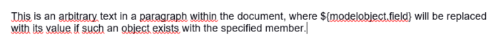
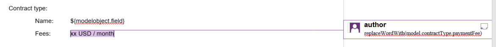

---
id: overview
title: Overview
sidebar_label: Overview
--- 

This tool is designed for companies dealing with several types of documents required by the processes when 
serving the customers. The major goals are
- to provide document generation features for the applications run by the company
- deal with WYSIWYG document templates to simplify internal work (creating new document versions, etc.
  without messing the templates with development-specific placeholders altering the layout and making the text 
  unreadable for non-tech people)
- support work with large, structured documents by allowing the templates to be split into multiple parts
- provide multi-language support (handle translations for a specific document)  
- help the staff to collect handouts by organizing different copies
- convert and concatenate documents to collect documents into business-related parts 

## Basics

This tool helps to fill-in documents dynamically with data provided by the hosting application.
To achieve this a template document has to be provided, which contains the static texts, paragraphs, etc. and 
control elements (placeholders, add-in functions and paragraph control markers).

## Templates 

### Supported template file formats

Templates parsable by this tool are regular documents. Currently 
- Ms word docx 
- Ms Excel xlsx

templates are supported. These will be called input format in the manual.

### Output formats 

The generated documents can be 
- left in the input format, or 
- converted to an output format (currently pdf).

### Control elements

This library fills in data described in control elements in the template placeholders/markers in the template files.
Placeholders are technically EL expressions evaluated during template processing. 

There are two kinds of control elements:
- data placeholders
- content control elements

#### Form data

The current data values for a specific document are specified through placeholders, which can be placed 

- either within the template text using the format of a dollar sign followed by an object property referenced 
  in curly braces (see [SPEL expression markup](https://en.wikipedia.org/wiki/Jakarta_Expression_Language))

  

#### Content control elements

These are markers for handling a specific content block like a paragraph, table row, etc., and can be 
specified through comments

  

Basically these are capabilities to
- display or hide a paragraph, or a table
- repeat a paragraph, or a table row

A detailed description of these elements can be found at the 
[docx-stamper project home](https://github.com/thombergs/docx-stamper).

| Comment expression             | Effect |
| ------------------------------ | ------ |
| `displayParagraphIf(boolean)`  | The commented paragraph is only displayed in the resulting .docx document if the boolean condition resolves to `true`.|
| `displayTableRowIf(boolean)`   | The table row surrounding the commented paragraph is only displayed in the resulting .docx document if the boolean condition resolves to `true`.|
| `displayTableIf(boolean)`      | The whole table surrounding the commented paragraph is only displayed in the resulting .docx document if the boolean condition resolves to `true`.|
| `repeatTableRow(List<Object>)` | The table row surrounding the commented paragraph is copied once for each object in the passed-in list. Expressions found in the cells of the table row are evaluated against the object from the list.
| `repeatDocPart(List<Object>)`  | Repeats the part of the document surrounded by the comment. The document part is copied once for each object in the passed-in list. Expressions found in the elements of the document part are evaluated against the object from the list. Can be used instead repeatTableRow and repeatParagraph if you want to repeat more than table rows and paragraphs.
| `replaceWordWith(expression)`  | Replaces the commented word (must be a single word!) with the value of the given expression. |

(The table above is copied from the [docx-stamper project home](https://github.com/thombergs/docx-stamper))

## Document sets

Document structures are templates organized into business defined groups.
(See [usage](usage.md) and the [component documentation](../documentation/components.md))