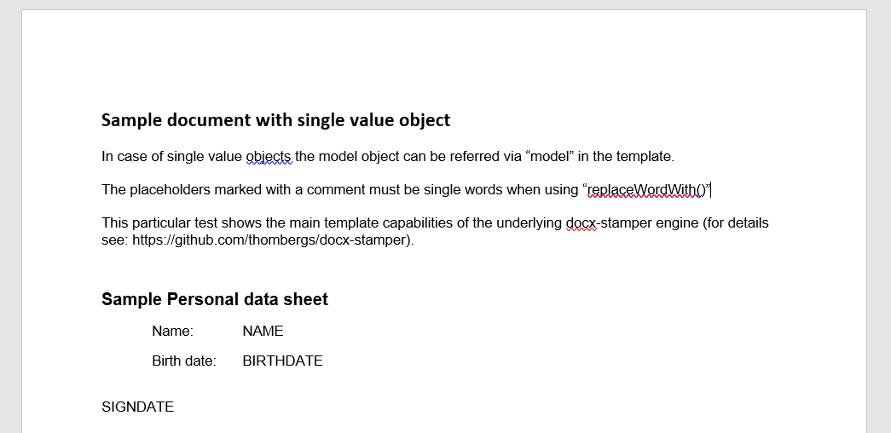
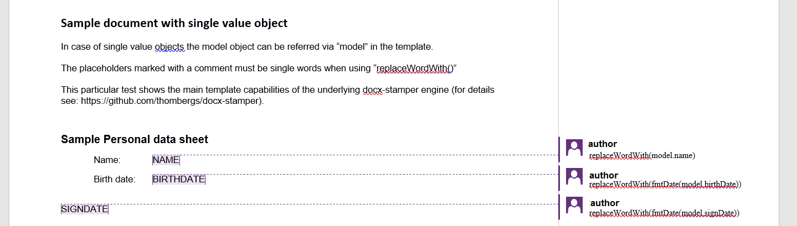

Currently, typed pojo DTOs are supported, thus you will need to add the generator to the project where
you would like to generate your documents.

For a showcase suppose the HR at your company uses the following document to summarize basic employee data:


(download: [personal_data_sheet_v1_3.docx](assets/personal_data_sheet_v1_3.docx))

## How it works

(In this example we assume a java project)

1. Construct the DTO you will use within the templates

As we can see in the form (and spec., etc. of course) we got, we have the provide the properties below
(in most cases we will have these classes in our business logic already done):

```java
package net.videki.templateutils.template.test.dto.contract;

import lombok.AllArgsConstructor;
import lombok.Data;
import net.videki.templateutils.template.core.dto.ITemplate;

import java.time.LocalDate;

@Data
@AllArgsConstructor
public class Person implements ITemplate {
    private String name;
    private LocalDate birthDate;
    private LocalDate signDate;
}
```

Implementing the <code>ITemplate</code> interface is optional, it provides convenience functions
you can use in your templates.

2. Markup the template

Now, add the control to the template:  


(download: [personal_data_sheet_v1_3-template.docx](assets/personal_data_sheet_v1_3-template.docx))

3. Add maven dependency

Maven:
```xml
  <dependency>
    <groupId>net.videki.template-utils</groupId>
    <artifactId>template-utils-core</artifactId>
    <version>1.0.1</version>
  </dependency>
```

Gradle:

```groovy
  compile group: 'net.videki.template-utils', name: 'template-utils-core', version: '1.0.1'
```
4. Add the generator config (template-utils.properties) to the project resources

```properties
# Document structure repository provider
repository.documentstructure.provider=net.videki.templateutils.template.core.provider.documentstructure.repository.filesystem.FileSystemDocumentStructureRepository
repository.documentstructure.builder=net.videki.templateutils.template.core.provider.documentstructure.builder.yaml.YmlDocStructureBuilder
repository.documentstructure.provider.basedir=documentstructures

# Template repository provider class
repository.template.provider=net.videki.templateutils.template.core.provider.templaterepository.filesystem.FileSystemTemplateRepository
repository.template.provider.basedir=templates

# InputTemplate processors
processors.docx=net.videki.templateutils.template.core.processor.input.docx.DocxStamperInputTemplateProcessor
processors.xlsx=net.videki.templateutils.template.core.processor.input.xlsx.JxlsInputTemplateProcessor

# Result repository provider class
repository.result.provider=net.videki.templateutils.template.core.provider.resultstore.filesystem.FileSystemResultStore
repository.result.provider.basedir=generated-documents

# Font base directory
converter.pdf.font-library.basedir=/fonts
```
(download: [template-utils.properties](assets/template-utils.properties))

- The <code>repository.documentstructure.provider.basedir</code> property specifies the template root location. 
  This can be also set to an external location containing the templates.  
  There is a helper class to handle folders within this doc root and provide full path for the template as shown 
  in the code below (see <code>FileSystemHelper.getFileNameWithPath(inputDir, fileName)</code>).
- The <code>repository.result.provider.basedir</code> property specifies the result root location.
  By default the basedir root is the output dir with the template name.
  This can be overridden by specifying the generation behaviour with <code>DocumentStructure</code>.

5. Add the document generator functionality to the business logic

The sample code below shows a simple fill-and-save scenario to the output dir, but the result can also be requested
as a stream. See the <code>TemplateService</code> interface for more information.

```java
package net.videki.templateutils.examples;

import net.videki.templateutils.examples.singletemplatepojo.dto.Person;
import net.videki.templateutils.template.core.service.TemplateServiceRegistry;
import net.videki.templateutils.template.core.service.exception.TemplateServiceException;
import net.videki.templateutils.template.core.util.FileSystemHelper;
import org.slf4j.Logger;
import org.slf4j.LoggerFactory;

import java.time.LocalDate;
import java.time.Month;

public class SingleTemplateDocxPojo {
    private static final Logger LOGGER = LoggerFactory.getLogger(SingleTemplateDocxPojo.class);

    // Only to demonstrate the usage  
    public static void main(String[] args) {
        final SingleTemplateDocxPojo appService = new SingleTemplateDocxPojo();

        appService.generateDocs();
    }

    public void generateDocs() {
        final String inputDir = "hr-files";
        final String fileName = "personal_data_sheet_v1_3-template.docx";

        final var data = getTemplateData();

        try {
            TemplateServiceRegistry.getInstance().fillAndSave(
                    FileSystemHelper.getFileNameWithPath(inputDir, fileName),
                    data);

        } catch (final TemplateServiceException e) {
            LOGGER.error("Error generating the result doc.", e);
        }

    }

    private Person getTemplateData() {
        // Mocking the business logic
        return new Person("John Doe",
                LocalDate.of(1970, Month.JULY, 20),
                LocalDate.of(2020, Month.NOVEMBER, 1));
    }
}
```
Done.